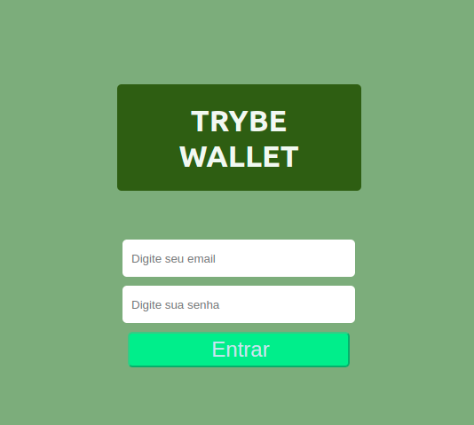
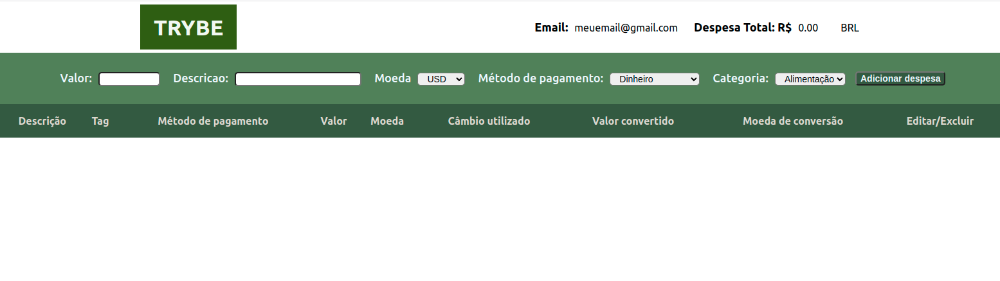
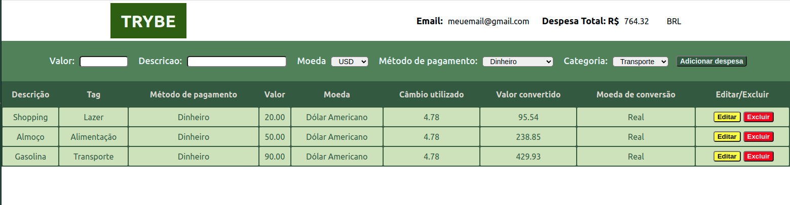

#  Projeto WALLET 

<!-- Olá, Tryber!

Esse é apenas um arquivo inicial para o README do seu projeto.

É essencial que você preencha esse documento por conta própria, ok?

Não deixe de usar nossas dicas de escrita de README de projetos, e deixe sua criatividade brilhar!

⚠️ IMPORTANTE: você precisa deixar nítido:
- quais arquivos/pastas foram desenvolvidos por você; 
- quais arquivos/pastas foram desenvolvidos por outra pessoa estudante;
- quais arquivos/pastas foram desenvolvidos pela Trybe.

-->

Neste projeto foi uma aplicação em React com uso do Redux como ferramenta de manipulação de estados.

Através dessa aplicação, é possível realizar as operações básicas de criação e manipulação de um estado de redux.

Foi desenvolvido uma carteira de controle de gastoscom conversor de moedas, ao utilizar a aplicação, o usuário é capaz de:

* Adicionar, remover e editar um gasto
* Visualizar uma tabela com seus gastos
* Visualizar o total de gastos convertidos para uma moeda de sua escolha

## Tela Inicial

## Tela Principal

## Habilidades trabalhadas no projeto

* Criar um store Redux em aplicações React

* Criar reducers no Redux em aplicações React

* Criar actions no Redux em aplicações React

* Criar dispatchers no Redux em aplicações React

* Conectar Redux aos componentes React

* Criar actions assíncronas na sua aplicação React que faz uso de Redux.

## Para rodar o projeto em sua máquina

* Clone este repositório
* Entre na pasta do repositório
* Instale as dependencias (**npm install**)
* Execute o projeto (**npm start**)